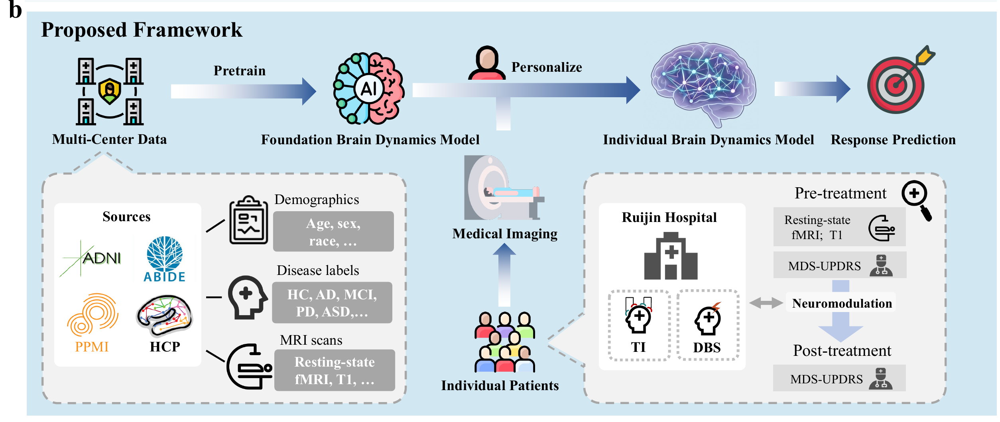
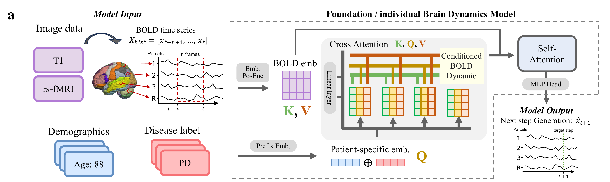
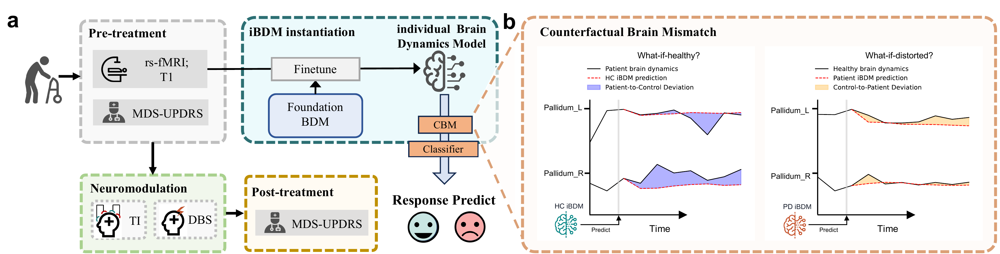

# Predicting Neuromodulation Outcome for Parkinson's Disease with Generative Virtual Brain Model

This repository provides the code implementation and data-processing workflow
for the Foundation Virtual Brain (FVB), individualized Virtual Brain (iVB), and
Counterfactual Brain Mismatch (CBM) analyses described in the manuscript.

## Overview

The framework transfers dynamical priors learned from large-scale resting-state
fMRI datasets to individual clinical time series and uses the generated BOLD
forecasts to derive CBM features for neuromodulation-response prediction.

### Framework overview



### Model architecture



### iVB workflow and counterfactual analysis



## Installation

The full study workflow uses Python 3.9:

```bash
conda env create -f environment.yml
conda activate vtb
```

## Data and input specification

The source imaging data are not mirrored in this repository. Obtain each public
dataset from its originating repository and follow its access and data-use
conditions:

| Dataset | Access |
|---|---|
| ADNI | [ADNI data access](https://adni.loni.usc.edu/data-samples/adni-data/) |
| PPMI | [PPMI data access](https://www.ppmi-info.org/access-data-specimens/download-data) |
| ABIDE | [NITRC/INDI ABIDE](http://fcon_1000.projects.nitrc.org/indi/abide/) |
| HCP Young Adult | [HCP 1200 Subjects release](https://www.humanconnectome.org/study/hcp-young-adult/document/1200-subjects-data-release) |
| AAL3 atlas | [AAL3](https://www.gin.cnrs.fr/en/tools/aal/) |

The model expects one preprocessed resting-state fMRI time series per CSV file:

- rows are consecutive BOLD frames;
- columns are 166 AAL3 regions in the project ordering;
- the first row contains column names;
- all values are finite numeric values.

Python preprocessing scripts and AAL3 resources are under `Data_process/`.
`Data_process/Data_label.csv` contains the public-cohort sample IDs, dataset
codes, and model labels used by the training loader.

## Running the full study workflow

### 1. Preprocessing

Run the applicable scripts under `Data_process/`, then place the resulting AAL3
CSV files in local dataset directories. Dataset paths can be configured in
`vtb/config.py` or supplied directly to the FVB command with repeatable
`--data_dir` arguments.

Volume-based preprocessing requires
[`dcm2niix`](https://github.com/rordenlab/dcm2niix) and
[FSL](https://fsl.fmrib.ox.ac.uk/fsl/fslwiki).

### 2. Pre-train FVB

Using the dataset paths in `vtb/config.py`:

```bash
python scripts/train_FVB.py --train
```

Or supply one or more preprocessed-data directories without editing source
code:

```bash
python scripts/train_FVB.py --train \
  --data_dir /path/to/HCP_AAL3_CSV \
  --data_dir /path/to/PPMI_AAL3_CSV \
  --label_path /path/to/Data_label.csv
```

This step produces the FVB checkpoint used in individualized analysis. The
model-architecture arguments used here must also be supplied when loading the
checkpoint in the next step.

### 3. Build iVBs for clinical participants

Set `CSV_DIR`, `MODEL_PATH`, `HEALTHY_CSV_PATH`, `HEALTHY_MODEL_PATH`, and
`OUTPUT_BASE` in `batch_iVB_final.sh`, then run:

```bash
bash batch_iVB_final.sh
```

The batch script calls `scripts/train_iVB.py` for each clinical CSV. The healthy
reference CSV and FVB checkpoint are used to calculate the two CBM components
during participant-specific fine-tuning. A single participant can also be run
directly:

```bash
python scripts/train_iVB.py \
  --patient_csv /path/to/participant.csv \
  --model_path /path/to/fvb_checkpoint.pth \
  --healthy_csv_path /path/to/healthy_reference.csv \
  --healthy_model_path /path/to/healthy_fvb_checkpoint.pth \
  --output_dir /path/to/ivb_output \
  --fine_tune
```

### 4. Response prediction

The TI and DBS classifiers and regressors are under `predict_exp/`. For example:

```bash
python predict_exp/DBS/diff/PP_diff.py
python predict_exp/DBS/diff_regression/PP_diff_regression.py
```

These scripts require the generated participant-level CBM features and the
corresponding controlled clinical tables. Update their input paths before use.

## Runnable demo

The following example runs without clinical data:

```bash
git clone https://github.com/desomeboy/Foundation-Individual-Generative-Virtual-Brain.git
cd Foundation-Individual-Generative-Virtual-Brain
conda env create -f environment-demo.yml
conda activate vtb-demo
"$CONDA_PREFIX/bin/python" scripts/run_demo.py --output-dir demo_outputs
```

The command creates artificial 166-region BOLD signals, applies per-region
temporal z-scoring, constructs seven-frame forecasting windows, runs a short
FVB optimization and participant-specific iVB fine-tuning, and saves:

```text
demo_outputs/
├── fvb_predictions.npy
├── ivb_predictions.npy
├── metrics.json
├── synthetic_participant_bold.csv
├── synthetic_reference_bold.csv
└── targets.npy
```

## License

The code is released under the Apache License 2.0. See [`LICENSE`](LICENSE).
